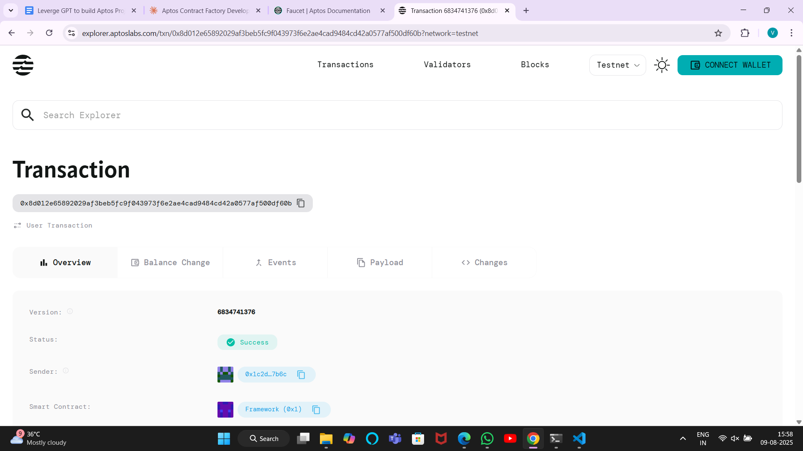

# Contract Factory

## Project Description

The Contract Factory is a smart contract platform built on Aptos that enables developers to create, store, and deploy standardized contract templates efficiently. This factory pattern allows for the mass production of commonly used smart contracts such as crowdfunding contracts, token contracts, NFT contracts, and more. Users can select from pre-built templates and deploy them instantly without writing code from scratch, significantly reducing development time and potential errors.

## Project Vision

Our vision is to democratize smart contract development by providing a user-friendly factory system that makes blockchain technology accessible to everyone. We aim to create a comprehensive ecosystem where developers can contribute templates, and users can easily deploy production-ready contracts with just a few clicks. By standardizing common contract patterns, we reduce the barrier to entry for blockchain development and promote best practices across the Aptos ecosystem.

## Key Features

- **Template Management**: Create and register reusable smart contract templates with standardized interfaces
- **One-Click Deployment**: Deploy contracts from templates instantly without manual coding
- **Template Library**: Browse through various contract types including crowdfunding, tokens, NFTs, and more
- **Deployment Tracking**: Monitor deployment statistics for both individual users and the entire platform
- **Creator Attribution**: Track template creators and their contribution to the ecosystem
- **Gas Optimization**: Efficient deployment process that minimizes transaction costs
- **Standardization**: Ensures deployed contracts follow best practices and security standards
- **Scalability**: Factory pattern allows for unlimited template creation and deployment
- **Version Control**: Template versioning system for continuous improvement and updates
- **Analytics Dashboard**: Real-time statistics on template usage and deployment trends

## Future Scope

- **Advanced Template Editor**: Web-based IDE for creating custom templates with drag-and-drop interface
- **Template Marketplace**: Economic incentives for template creators through usage fees and royalties
- **Multi-Chain Support**: Expand beyond Aptos to support Ethereum, Solana, and other blockchain networks
- **AI-Powered Templates**: Machine learning algorithms to suggest optimal contract configurations
- **Audit Integration**: Automated security auditing for all templates before deployment
- **Governance System**: Decentralized voting mechanism for template approval and platform upgrades
- **Template Inheritance**: Support for template composition and inheritance patterns
- **Testing Framework**: Built-in testing suite for template validation and contract simulation
- **Cross-Contract Communication**: Enable deployed contracts to interact seamlessly with each other
- **Enterprise Solutions**: White-label factory deployments for organizations and institutions
- **Mobile SDK**: Native mobile applications for contract deployment and management
- **Integration APIs**: REST and GraphQL APIs for third-party platform integration

## Contract Details
0x8d012e65892029af3beb5fc9f043973f6e2ae4cad9484cd42a0577af500df60b

